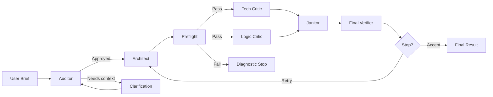
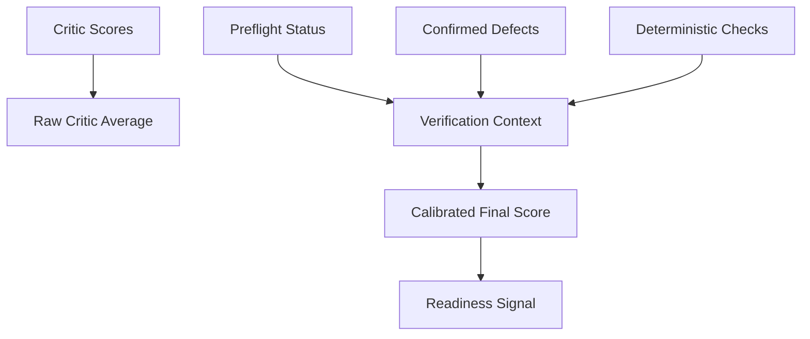
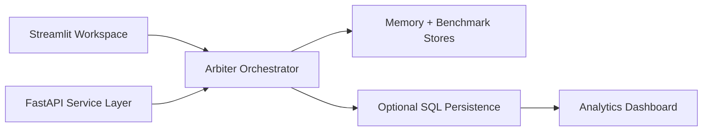

# The Arbiter

**The Arbiter is a multi-agent quality and reasoning layer for LLM work: it audits the brief, drafts the answer, challenges it with specialist critics, compresses disagreement into a repair brief, verifies the result, and carries forward the lessons that are worth reusing.**

It is built for people who want more than "send prompt, hope for the best."

The Arbiter exists because high-quality AI work usually fails for predictable reasons:
- the brief is underspecified
- the first draft gets trusted too early
- retries are noisy and unstructured
- provider issues get hidden behind fake confidence
- scoring and trust get conflated

The Arbiter is designed to reduce exactly that.

---

## What It Does

The Arbiter turns a single request into a governed reasoning loop.

Instead of relying on one model and one answer, it coordinates distinct roles:
- `Auditor` checks whether the brief is clear enough to proceed
- `Architect` produces the main draft or deliverable
- `Tech Critic` tests execution quality, implementation rigor, and operational feasibility
- `Logic Critic` tests reasoning quality, requirement coverage, and structural coherence
- `Janitor` consolidates the dispute into a cleaner retry brief
- `Final Verifier` runs deterministic checks so the final score is more honest

This is not just an "agent framework." It is a quality-control system for AI outputs.

---

## Why It Matters

Most AI workflows still look like this:

1. send prompt
2. get answer
3. hope the answer is good

That approach breaks down when the task has:
- real ambiguity
- business consequences
- implementation constraints
- competing priorities
- multiple valid-looking but weak outcomes

The Arbiter adds structure where one-shot prompting usually collapses.

---

## Architecture Blueprints

### 1. Reasoning Loop



### 2. Trust Stack



### 3. Product Surfaces



---

## Core Capabilities

### Multi-agent orchestration with clear role boundaries
The Arbiter deliberately separates briefing, drafting, critique, repair, and verification instead of collapsing them into one vague "agent loop."

### Auditor-gated execution
The system asks for missing context early, before it wastes critic spend on a brief that is too vague.

### Janitor-led retries
Retries are driven by a compact repair brief, not a chaotic wall of critic text. This makes later rounds far more stable.

### Verification-aware scoring
The system distinguishes:
- `Critic Average`
- `Calibrated Score`
- `Verification`
- `Confidence`
- `Readiness`

That means a result can look strong to critics and still be marked as cautionary by verification.

### Memory with lifecycle control
The Arbiter stores repair patterns, trusted context, project notes, and benchmark history, while also tracking whether memory is active, cautionary, conflicted, or obsolete.

### Provider and model control
The system supports multiple providers and lets the operator choose presets, provider locks, stable mode, and role-specific models instead of hiding those tradeoffs.

### Cost and token awareness
The Arbiter records per-call usage metadata, tracks estimated run cost, and aims to make cost a visible operating variable instead of an afterthought.

### Optional persistence and API surface
The project now includes a FastAPI service layer, optional SQL persistence, Alembic scaffolding, and a separate analytics dashboard without removing the original Streamlit workspace.

---

## Task Modes

The Arbiter is not software-only.

It currently supports:
- `Software & IT`
- `Marketing & Growth`
- `Business & Operations`
- `Writing & Content`
- `Personal Planning`
- `General Problem Solving`

Each mode changes the system's:
- auditing emphasis
- architect guidance
- critic weighting
- verifier expectations
- deliverable format

That matters because a code task, a founder memo, and an operations workflow should not be judged with the same rubric.

---

## How Scoring Works

This is one of the most important concepts in the product.

The Arbiter does **not** treat score and trust as the same thing.

### Critic Average
This is the raw average from the technical and logic critics, using task-aware score weights.

### Calibrated Score
This is the final round score after deterministic verification adjusts the critic average up or down based on:
- caution points
- confirmed defects
- structural checks
- blocked or failed verification paths

### Verification
Verification reports whether the result is:
- `VERIFIED`
- `CAUTION`
- `FAILED`
- `BLOCKED`

### Readiness
Readiness is the operational signal:
- `READY`
- `CLOSE`
- `NEEDS REVIEW`
- `BLOCKED`

This is the core idea: a result can look good, but still not be trustworthy enough to treat as finished.

---

## Cost and Efficiency Model

The Arbiter is not "cheap" because it does less.
It is cheaper because it tries to spend model calls more deliberately.

That cost discipline comes from architecture:

### Preflight before critic spend
If a draft is structurally broken, preflight can stop a bad round before it burns full review cost.

### Janitor compression
Instead of feeding raw multi-agent noise back into the next draft, Janitor produces a compact repair brief that reduces retry waste.

### Model and provider controls
The operator can intentionally choose cheaper or stronger paths depending on the task and phase of work.

### Memory reuse
Repeated task families do not always need to restart from zero.

### Verification pressure
The system reduces the hidden downstream cost of false confidence by separating "looks good" from "is actually ready."

Important honesty note:
- run cost is meant to be operationally useful and increasingly token-aware
- it is not framed here as audited invoice-grade billing

---

## What Makes The Arbiter Different

### Compared to one-shot prompting
It adds governed iteration, specialist critique, retry discipline, and post-generation verification.

### Compared to generic agent wrappers
It is opinionated about quality control. The goal is not just orchestration; the goal is more reliable output.

### Compared to systems that only optimize for output fluency
The Arbiter tries to expose failure states, calibration, blocked runs, and verification pressure instead of hiding them behind polished language.

### Compared to frameworks like LangGraph, CrewAI, or AutoGen
The Arbiter is less about letting you wire arbitrary agents together and more about delivering a specific operating model:
- audit first
- draft second
- critique in parallel
- repair through Janitor
- calibrate trust before calling the result good

That is a product philosophy, not just a technical implementation detail.

---

## Current Product Surface

### Streamlit workspace
The main app focuses on:
- submitting the brief
- watching the role flow
- reading the latest order
- seeing score, verification, readiness, and Janitor output

### Analytics dashboard
A separate Streamlit analytics page is available for:
- run overview
- run explorer
- score trends
- benchmark summaries
- system-level signals

### FastAPI service layer
The repository now includes a FastAPI app factory, versioned API structure, and a run endpoint path so The Arbiter can grow beyond a purely local UI.

### Optional SQL persistence
SQLite/PostgreSQL-compatible persistence scaffolding exists alongside the original local-memory approach, with local schema bootstrap support for the SQLite path.

---

## Repository Structure

```text
arbiter/
  agents/      # role implementations
  api/         # FastAPI layer
  app/         # Streamlit workspace + analytics
  config/      # settings, pricing, task profiles
  core/        # orchestrator, iteration engine, scoring, stopping, verification
  infra/       # clients, memory, benchmarks, model registry, DB, logging
  models/      # state and result models
  prompts/     # mode-aware prompt construction
tests/         # offline tests
alembic/       # migration scaffolding
```

Key entry points:
- `arbiter/app/streamlit_app.py`
- `arbiter/app/analytics_dashboard.py`
- `arbiter/api/main.py`
- `arbiter/core/orchestrator.py`
- `arbiter/core/iteration_engine.py`
- `arbiter/core/final_verifier.py`

---

## Quick Start

```bash
git clone https://github.com/lucaomul/TheArbiter.git
cd TheArbiter
python3 -m venv .venv
source .venv/bin/activate
python -m pip install -e .
```

Create a `.env` file with the provider keys you want to use:

```env
GROQ_API_KEY=...
OPENAI_API_KEY=...
GEMINI_API_KEY=...
ANTHROPIC_API_KEY=...
```

You do not need every provider configured at once.

---

## Run The Product

### Main Streamlit app

```bash
python -m streamlit run arbiter/app/streamlit_app.py
```

Open:
- [http://localhost:8501](http://localhost:8501)

### Analytics dashboard

```bash
python -m streamlit run arbiter/app/analytics_dashboard.py
```

### FastAPI server

```bash
python arbiter/api/run_server.py
```

Open:
- [http://localhost:8000/docs](http://localhost:8000/docs)

---

## Example Use Cases

### Software & IT
- build and review implementation drafts
- stress-test logic before shipping code
- use Janitor repair loops instead of blind retries

### Marketing & Growth
- generate GTM plans, funnels, and positioning documents
- pressure-test strategy quality before accepting the draft

### Business & Operations
- design SOPs, operating systems, workflows, and service recovery logic

### Writing & Content
- produce founder memos, strategic documents, long-form writing, and structured argumentation

### Personal Planning
- build realistic, phased plans with tradeoffs, tracking, and fallback logic

---

## Current Limitations

The Arbiter is strong, but it is not magic.

Current limitations include:
- software validation is still more mature than some non-software validators
- the FastAPI and SQL layers are new and still maturing
- cost accounting is increasingly grounded, but should not be mistaken for audited billing
- the project still benefits from more real-world benchmark coverage across non-software task families
- Streamlit remains the fastest product surface, but not the final ceiling for UX

This README is intentionally ambitious about the product direction and intentionally honest about what is still evolving.

---

## Roadmap Direction

Near-term priorities:
- stronger validators across every task mode
- richer analytics and benchmark comparison
- deeper persistence and API maturity
- cleaner deployment paths
- more stable long-running operational behavior

Long-term direction:
- a serious quality and reasoning operating system for agentic AI workflows

---

## Built By

**Luca Crăciun**

- GitHub: [lucaomul](https://github.com/lucaomul)
- LinkedIn: [Luca Crăciun](https://www.linkedin.com/in/luca-craciun-52a2a9218/)

The Arbiter is being built as a serious open-source product around a simple idea:

**AI systems should not only generate. They should audit, challenge, repair, verify, and earn trust.**
