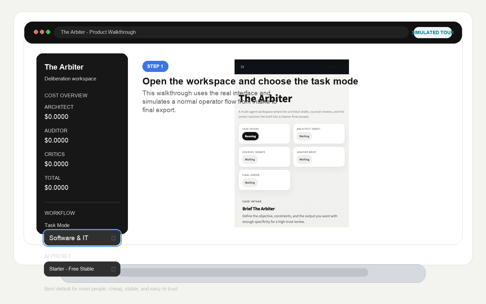
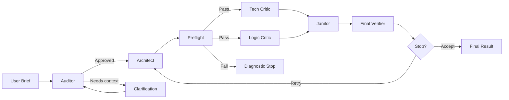
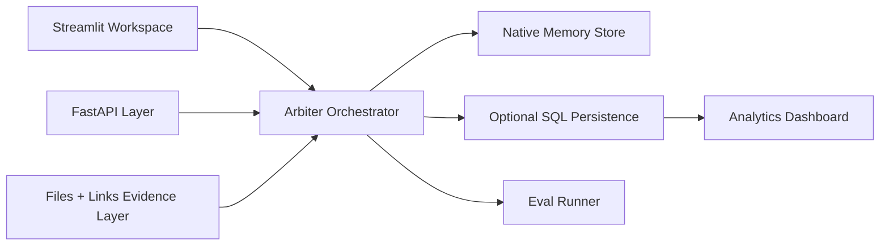

# The Arbiter

**The Arbiter is a multi-agent quality, reasoning, and verification layer for LLM work.** It audits the brief, drafts the output, challenges it with specialist critics, compresses the disagreement into a repair brief, verifies the result, and carries forward reusable lessons when the run is worth remembering.


It is built for operators who want more than "send prompt, hope for the best."

## Product Tour



[Open the full demo GIF directly](https://raw.githubusercontent.com/lucaomul/TheArbiter/main/docs/assets/arbiter-demo.gif)

This walkthrough is captured from the real interface during a live local session.
Live runs can still take longer than the GIF suggests depending on task complexity, provider availability, rate limits, evidence size, and whether the larger software team path is activated.

The workspace is designed around one job: take a brief, challenge it hard, and make the trust state visible before a user acts on the answer.

What you get in the product today:
- an Auditor that can stop weak briefs before the expensive loop begins
- an Architect path that can expand into a specialist software team for large `Software & IT` tasks
- a Tech Critic and Logic Critic that score the output from different angles
- a Janitor that repairs against a structured defect brief instead of random retries
- a Final Verifier that can apply deterministic checks, grounding discipline, quote discipline, and software-aware validation
- file, link, and lightweight local RAG support so the system can reason from actual evidence instead of prompt-only context
- export surfaces for `PDF`, `CSV`, and `XLSX`
- an API, analytics dashboard, benchmark runner, and durable memory layer around the loop

## What Problem It Solves

Most LLM workflows fail in repeatable ways:
- the brief is too vague
- the first draft is trusted too early
- retries are noisy and expensive
- critic feedback is redundant instead of actionable
- score, trust, and readiness get collapsed into one misleading number

The Arbiter exists to make those failure modes visible and govern them with a structured loop instead of a one-shot answer.

## Why It Feels Different

The Arbiter is not trying to be "another chatbot with more buttons." It is trying to be a quality-control system for AI work.

That means:
- trust is separated from style
- verification is separated from critic opinion
- blocked or weak evidence is surfaced instead of hidden
- large software tasks can justify a larger delivery team instead of forcing one generalist answer
- runs leave behind memory, benchmark history, and review telemetry that can be inspected later

## Architecture Overview



The project now also exposes a service and persistence surface around that loop:



More detail lives in [docs/architecture.md](docs/architecture.md).

## Dynamic Software Architect Team

For larger `Software & IT` tasks, The Arbiter can expand the normal Architect step into a small specialist architecture team instead of relying on one monolithic planning pass.

Why it exists:
- large software tasks often span multiple delivery surfaces at once
- backend, frontend, data, security, and operations concerns can get blurred in a single response
- critics do better when the proposed solution already has clearer subsystem boundaries

When it activates:
- only for `Software & IT`
- only when the router sees enough complexity signals, such as multi-domain scope, full-stack or production wording, multiple technologies, or a very detailed build brief

Core roles:
- `Lead Software Architect`
- `Backend Architect`
- `Frontend Architect`
- `Database Architect`
- `DevOps & Reliability Architect`

Conditional roles:
- `Security Architect`
- `QA/Test Architect`
- `Integration Architect`
- `Performance Architect`

How it works:
- the router decides whether team mode is worth using
- the lead specialist defines the shared delivery blueprint
- the remaining specialists work in parallel when safe
- their structured plans are synthesized into one integrated architecture package
- that package then flows through the normal critics, Janitor, scoring, stopping, and verifier pipeline

How to disable it:
- set `SETTINGS.software_team_enabled = False`
- or raise `SETTINGS.software_team_min_complexity_score`

## Evidence-Aware Files, Links, and RAG

The Arbiter can now accept supporting materials instead of relying only on the text typed into the prompt box.

Supported evidence inputs:
- local files such as `PDF`, `DOCX`, `TXT`, `MD`, `JSON`, `CSV`, and code/text documents
- web links and reference URLs

How it works:
- the evidence layer extracts readable text from each source
- long sources are chunked into smaller passages
- a lightweight local retrieval pass ranks the most relevant chunks against the user task
- those retrieved excerpts are injected into the task payload as source-grounded context
- the verifier can use attached source names and quoted evidence when judging whether the answer is truly grounded

Why this matters:
- better factual grounding
- better quote and citation behavior
- less dependence on the user pasting long raw context into the prompt
- better transparency about what the model actually used

## Task Modes

The Arbiter is not software-only. It currently supports:
- `Software & IT`
- `Marketing & Growth`
- `Business & Operations`
- `Writing & Content`
- `Personal Planning`
- `General Problem Solving`

Those modes change:
- auditing emphasis
- architect guidance
- critic weighting
- output expectations
- verifier behavior

That matters because a code task, a GTM brief, and a founder memo should not be judged with the same rubric.

## Trust Model

The Arbiter separates quality from confidence.

- `Critic Average` is the raw weighted view from the Tech Critic and Logic Critic.
- `Final Verified Score` is the final round score after deterministic verification adjusts the critic average.
- `Verification Status` reports whether the output is `VERIFIED`, `CAUTION`, `FAILED`, or `BLOCKED`.
- `Readiness` reports whether the system believes the result is `READY`, `CLOSE`, `NEEDS REVIEW`, or `BLOCKED`.

That means an answer can sound strong, score well with critics, and still be marked cautionary if verification does not clear it.

## Quickstart

Clone the repo and create a local environment:

```bash
git clone https://github.com/lucaomul/TheArbiter.git
cd TheArbiter
python3 -m venv .venv
source .venv/bin/activate
python -m pip install --upgrade pip
python -m pip install -e ".[dev,api]"
```

If you want Chroma-backed memory retrieval too:

```bash
python -m pip install -e ".[dev,api,chromadb]"
```

Create a `.env` file with the provider keys you want to use:

```env
OPENAI_API_KEY=...
GROQ_API_KEY=...
GEMINI_API_KEY=...
ANTHROPIC_API_KEY=...
```

You do not need every provider configured at once.

## Running The Product

### Streamlit workspace

```bash
python -m streamlit run arbiter/app/streamlit_app.py
```

Open [http://localhost:8501](http://localhost:8501).

The workspace supports:
- optional file attachments
- optional supporting links
- an evidence context panel showing retrieved source chunks and ingestion warnings
- final report export as `PDF`, `CSV`, or `XLSX`

Spreadsheet export behavior:
- markdown tables are preserved as structured spreadsheet data when present
- prose outputs fall back to a clean narrative workbook with section-aware rows
- export metadata includes task mode, run id, iteration count, and score summary

### Analytics dashboard

```bash
python -m streamlit run arbiter/app/analytics_dashboard.py
```

### FastAPI service layer

```bash
python arbiter/api/run_server.py
```

Open [http://localhost:8000/docs](http://localhost:8000/docs).

### Package entry

```bash
python -m arbiter
```

This prints the installed version and the main launch commands.

## Engineering Workflow

The repo ships with a small `Makefile` for the core contributor loop:

```bash
make install-dev
make lint
make test
make eval-dry-run
```

If `.venv/bin/python` exists, those targets use it automatically.

CI runs the same trust-preserving checks on Python `3.10` and `3.11`:
- `ruff check .`
- `pytest --tb=short`
- `python -m evals.runner --dry-run`

## API Usage Example

Submit a run:

```bash
curl -X POST http://localhost:8000/api/v1/runs \
  -H "Content-Type: application/json" \
  -d '{
    "user_input": "Write a founder memo about prioritizing reliability before advanced AI features.",
    "task_mode": "Writing & Content",
    "max_iterations": 3,
    "target_score": 8.0,
    "supporting_urls": ["https://example.com/internal-memo"],
    "supporting_materials": [
      {
        "name": "brief.txt",
        "media_type": "text/plain",
        "content": "Use this internal brief as primary evidence.",
        "source_type": "file"
      }
    ]
  }'
```

List available models:

```bash
curl http://localhost:8000/api/v1/models
```

API routes, auth rules, and example responses are documented in [docs/api.md](docs/api.md).

## Benchmarks / Evals

The repo now includes an `evals/` package with representative fixture tasks across all six task modes.

Dry-run mode is designed for CI and does not call real model providers:

```bash
python -m evals.runner --dry-run
```

To compare the baseline single-model path against the full Arbiter path:

```bash
python -m evals.runner --compare --output jsonl
```

Important honesty note:
- dry-run eval scores are synthetic and operational
- they are useful for regression protection, not for marketing claims

More detail lives in [docs/benchmarks.md](docs/benchmarks.md).

## Cost Model Summary

The Arbiter tracks cost as an operational control variable, not as a decorative metric.

Current cost handling combines:
- provider token usage when available
- model-level pricing tables
- conservative fallback estimation when a provider omits usage
- zero-cost cache hits

That makes the numbers directionally useful for product and benchmark work, but they should not be framed as audited billing statements.

## Security Notes

The API keeps local development convenient, but it now supports production-safe behavior:

- in local/dev mode, protected routes can be used without an API key
- if `ARBITER_ENV=production`, protected routes fail closed when `API_KEY` is missing or invalid
- groundwork is in place for rate-limit headers

Do not commit `.env` files or provider keys.

## Optional Dependencies

The repo is intentionally layered:

- base install: Streamlit workspace and core orchestration
- `.[api]`: FastAPI, SQLAlchemy, Alembic, and related API/persistence pieces
- `.[chromadb]`: optional Chroma-backed retrieval
- `.[dev]`: test, lint, and contributor tooling

For backwards compatibility, `requirements.txt` is still present, but contributor work should prefer editable installs through `pyproject.toml`.

## Benchmark History Controls

Benchmark and eval history normally writes into `.arbiter_memory/benchmark_runs.jsonl`.

If that path is blocked or you want to redirect it explicitly, you can set:

- `ARBITER_BENCHMARK_DIR`
- `ARBITER_BENCHMARK_PATH`

If the primary location is not writable, The Arbiter now falls back to a temp-backed benchmark store and exposes that status in the analytics dashboard.

## Repository Layout

```text
arbiter/
  agents/      # role implementations
  api/         # FastAPI layer
  app/         # Streamlit workspace + analytics
  config/      # settings, pricing, task profiles
  core/        # orchestration, scoring, stopping, verification
  infra/       # memory, models, DB, registry, logging, LLM client
  models/      # state and result models
  prompts/     # task-mode prompt construction
alembic/       # migration scaffolding
evals/         # benchmark fixtures and runner
tests/         # offline test suite
docs/          # project documentation
```

## Documentation Map

- [docs/architecture.md](docs/architecture.md)
- [docs/api.md](docs/api.md)
- [docs/benchmarks.md](docs/benchmarks.md)
- [docs/development.md](docs/development.md)
- [CONTRIBUTING.md](CONTRIBUTING.md)
- [SECURITY.md](SECURITY.md)

## Current Limitations

The Arbiter is already useful, but it is still evolving.

Current limitations include:
- software verification remains more mature than some non-software validators
- the API and SQL layers are newer than the Streamlit workspace
- long-run benchmark evidence is still growing
- analytics and eval reporting are early product surfaces, not finished BI tools
- cost reporting is increasingly grounded, but still operational rather than invoice-grade

This README is intentionally ambitious about the product direction and intentionally honest about what is still maturing.

## Built By

**Luca Crăciun**

- GitHub: [lucaomul](https://github.com/lucaomul)
- LinkedIn: [Luca Crăciun](https://www.linkedin.com/in/luca-craciun-52a2a9218/)

The Arbiter is being built around a simple conviction:

**AI systems should not only generate. They should audit, challenge, repair, verify, and earn trust.**
